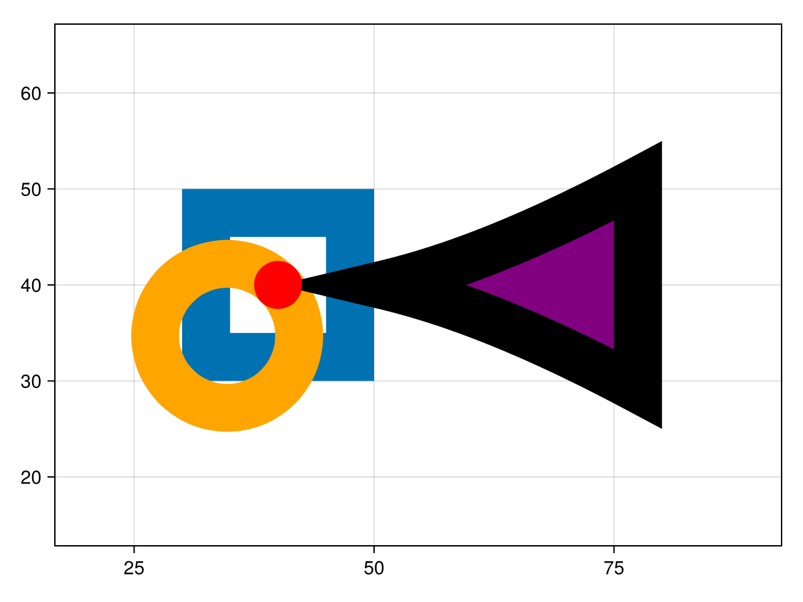
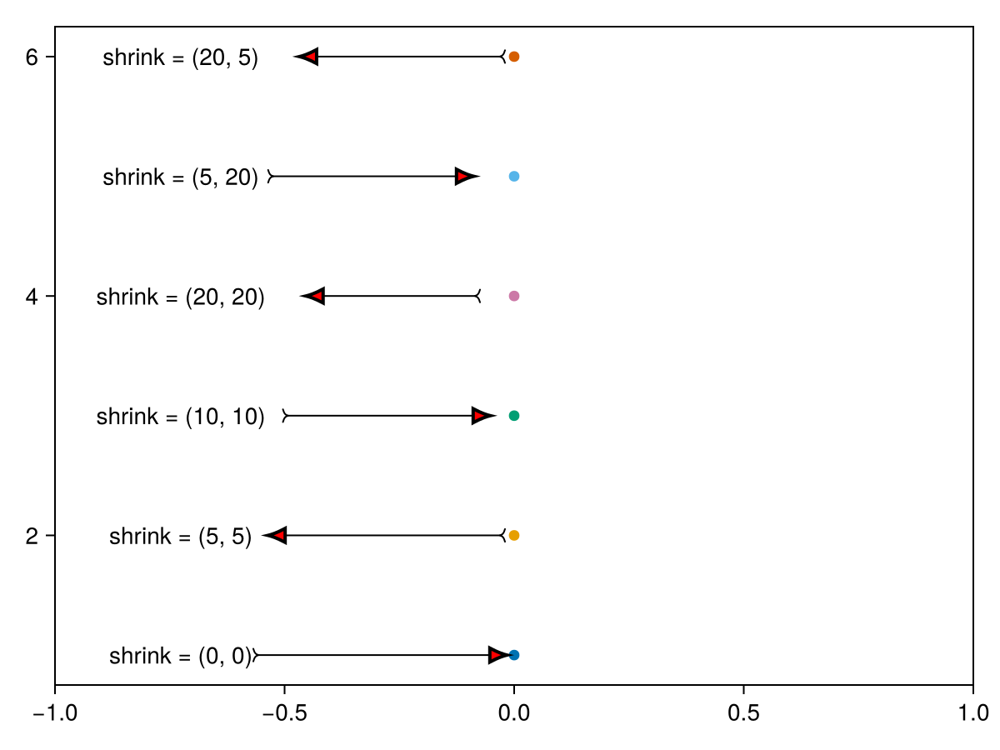

**WIP**

* `sprinkle` instead of `scatter`; can take an `AbstractBezigonSpec` as marker.
* `AbstractBezigonSpec` takes plot attributes (e.g. `strokewidth`) to produce a dynamically
  sized `AbstractBezigonInstance`.
* `PathArrow(; tip = nothing, head = nothing)` can be used as style in `annotation` and use
  such markers at the path ends. 

```julia
using CairoMakie
using MakieBezigons
f = let
    pos = [
        (0, 0),
    ]
    fig = Figure()
    ax = Axis(fig[1,1]; aspect = DataAspect())
       
    sprinkle!(
        ax, (40, 40); 
        marker = MakieBezigons.Rect(; filled=false),
        markersize = 20, 
        markerspace = :data,
        strokewidth = 5,
    )

    sprinkle!(
        ax, (40, 40); 
        marker = MakieBezigons.Bullet(; filled=false, target_anchor = (1, 1)),
        markersize = 20, 
        markerspace = :data,
        color = :orange,
        strokewidth = 5,
    )
    
    sprinkle!(
        ax, (40, 40); 
        marker = MakieBezigons.LatexTip(; length = 40),
        markersize = 1, 
        markerspace = :data,
        color = :purple,
        strokecolor = :black,
        strokewidth = 5,
    )

    scatter!(
        ax, (40, 40); 
        color = :red,
        markerspace=:data, marker = Makie.Circle, markersize = 5,
    )
    fig
end
```


```julia
f = let
    fig = Figure()
    ax = Axis(fig[1, 1], xgridvisible = false, ygridvisible = false)
    shrinks = [(0, 0), (5, 5), (10, 10), (20, 20), (5, 20), (20, 5)]
    style_odd = MakieBezigons.PathArrow(; 
        tip = MakieBezigons.LatexTip(; scale=2, fillcolor=:red, line_width = (0, 2)),
        tail = MakieBezigons.ComputerModernRightTail()
    )
    style_even = MakieBezigons.PathArrow(; 
        tip = MakieBezigons.ComputerModernRightTail(),
        tail = MakieBezigons.LatexTip(; scale=2, fillcolor=:red, line_width = (0, 2))
    )
    for (i, shrink) in enumerate(shrinks)
        style = i % 2 == 1 ? style_odd : style_even
        scatter!(ax, 0, i; markersize=9)
        annotation!(ax, -200, 0, 0, i; text = "shrink = $shrink", shrink, style)
    end
    fig
end
```
